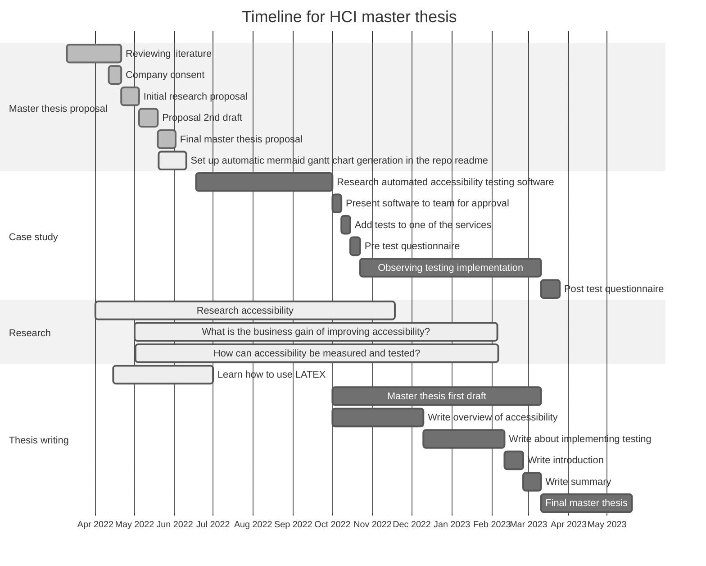

```mermaid
gantt
	%%{init: {'theme': 'neutral'}}%%
	axisFormat  %b %Y
	title Timeline for HCI master thesis	
	dateFormat YYYY-MM-DD

section Master thesis proposal 
Reviewing literature :done,  I_kwDOHN4WtM5IPt0e, 2022-03-10, 6w 
Company consent :done,  I_kwDOHN4WtM5IPjR4, 2022-04-11, 10d 
Initial research proposal :done,  I_kwDOHN4WtM5IPQAc, after I_kwDOHN4WtM5IPt0e, 2w 
Proposal 2nd draft :done,  I_kwDOHN4WtM5IPQdj, after I_kwDOHN4WtM5IPQAc, 2w 
Final master thesis proposal :done,  I_kwDOHN4WtM5IO6RY, after I_kwDOHN4WtM5IPQdj, 2w 
Set up automatic mermaid gantt chart generation in the repo readme :active,  I_kwDOHN4WtM5KFnVy, 2022-05-20, 3w 
	 
section Case study 
Research automated accessibility testing software : I_kwDOHN4WtM5IPCPt, 2022-06-18, 15w 
Present software to team for approval : I_kwDOHN4WtM5IPKxI, after I_kwDOHN4WtM5IPCPt, 1w 
Add tests to one of the services  : I_kwDOHN4WtM5IPSTR, after I_kwDOHN4WtM5IPKxI, 1w 
Pre test questionnaire : I_kwDOHN4WtM5IPPfv, after I_kwDOHN4WtM5IPSTR, 1w 
Observing testing implementation : I_kwDOHN4WtM5IPS6R, after I_kwDOHN4WtM5IPPfv, 20w 
Post test questionnaire : I_kwDOHN4WtM5IPr5f, after I_kwDOHN4WtM5IPS6R, 2w 
 
section Research 
Research accessibility :active,  I_kwDOHN4WtM5IP7K7, 2022-04-01, 33w 
What is the business gain of improving accessibility? :active,  I_kwDOHN4WtM5Jr4kn, 2022-05-01, 40w 
How can accessibility be measured and tested? :active,  I_kwDOHN4WtM5Jr4tP, 2022-05-02, 40w 
 
section Thesis writing 
Learn how to use LATEX :active,  I_kwDOHN4WtM5IPfGo, 2022-04-15, 11w 
Master thesis first draft : I_kwDOHN4WtM5IPWkC, 2022-10-01, 23w 
Write overview of accessibility : I_kwDOHN4WtM5IPeB8, 2022-10-01, 10w 
Write about implementing testing : I_kwDOHN4WtM5IRoTT, after I_kwDOHN4WtM5IPeB8, 9w 
Write introduction : I_kwDOHN4WtM5IPdl3, after I_kwDOHN4WtM5IRoTT, 2w 
Write summary : I_kwDOHN4WtM5IPdrk, after I_kwDOHN4WtM5IPdl3, 2w 
Final master thesis : I_kwDOHN4WtM5IPXSh, after I_kwDOHN4WtM5IPWkC, 10w 

```