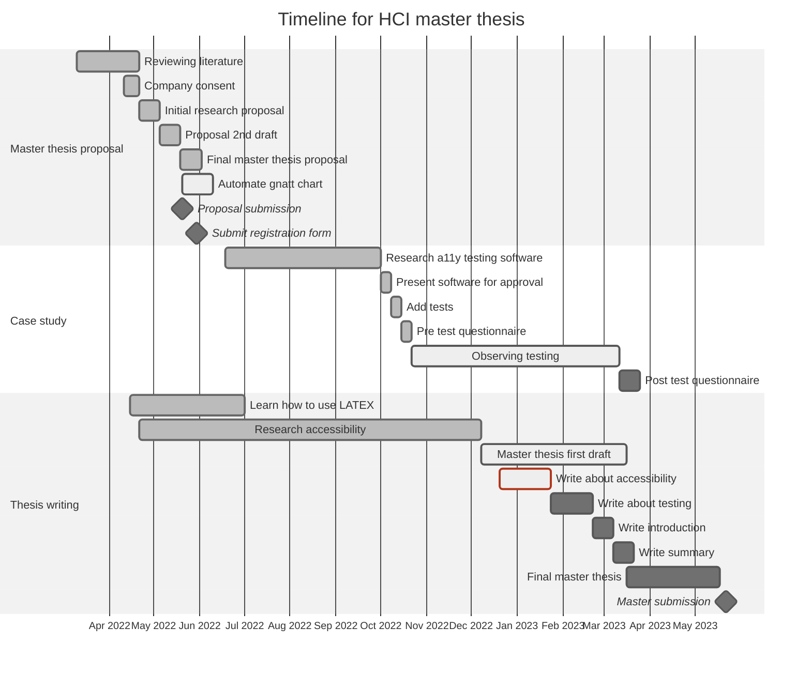

```mermaid
gantt
	%%{init: {'theme': 'neutral'}}%%
	axisFormat  %b %Y
	title Timeline for HCI master thesis	
	dateFormat YYYY-MM-DD

section Master thesis proposal 
Reviewing literature 			:done,  		I_kwDOHN4WtM5IPt0e, 	2022-03-10, 				6w 
Company consent 				:done,  		I_kwDOHN4WtM5IPjR4, 	2022-04-11, 				10d 
Initial research proposal 		:done,  		I_kwDOHN4WtM5IPQAc, 	after I_kwDOHN4WtM5IPt0e, 	2w 
Proposal 2nd draft 				:done,  		I_kwDOHN4WtM5IPQdj, 	after I_kwDOHN4WtM5IPQAc, 	2w 
Final master thesis proposal 	:done,  		I_kwDOHN4WtM5IO6RY, 	after I_kwDOHN4WtM5IPQdj, 	2w 
Automate gnatt chart 			:active,  		I_kwDOHN4WtM5KFnVy, 	2022-05-20, 				3w 
Proposal submission 			:milestone, 	I_1, 					2022-05-20, 				0d 
Submit registration form 		:milestone, 	I_2, 					2022-05-30, 				0d 
	 
section Case study 
Research a11y testing software 	:done, 			I_kwDOHN4WtM5IPCPt, 	2022-06-18, 				15w 
Present software for approval 	:done, 			I_kwDOHN4WtM5IPKxI, 	after I_kwDOHN4WtM5IPCPt, 	1w 
Add tests  						:done, 			I_kwDOHN4WtM5IPSTR, 	after I_kwDOHN4WtM5IPKxI, 	1w 
Pre test questionnaire 			:done, 			I_kwDOHN4WtM5IPPfv, 	after I_kwDOHN4WtM5IPSTR, 	1w 
Observing testing  				:active, 		I_kwDOHN4WtM5IPS6R, 	after I_kwDOHN4WtM5IPPfv, 	20w 
Post test questionnaire 		: 				I_kwDOHN4WtM5IPr5f, 	after I_kwDOHN4WtM5IPS6R, 	2w 
 
section Thesis writing 
Learn how to use LATEX 			:done, 			I_kwDOHN4WtM5IPfGo, 	2022-04-15, 				11w 
Research accessibility 			:done, 			I_kwDOHN4WtM5IP7K7, 	after I_kwDOHN4WtM5IPjR4, 	33w 
Master thesis first draft 		:active, 		I_kwDOHN4WtM5IPWkC, 	after I_kwDOHN4WtM5IP7K7, 	14w 
Write about accessibility 		:active, crit, 	I_kwDOHN4WtM5IPeB8, 	2022-12-20, 				5w 
Write about testing 			:		 		I_kwDOHN4WtM5IRoTT, 	after I_kwDOHN4WtM5IPeB8, 	4w 
Write introduction 				: 				I_kwDOHN4WtM5IPdl3, 	after I_kwDOHN4WtM5IRoTT, 	2w 
Write summary 					: 				I_kwDOHN4WtM5IPdrk, 	after I_kwDOHN4WtM5IPdl3, 	2w 
Final master thesis 			: 				I_kwDOHN4WtM5IPXSh, 	after I_kwDOHN4WtM5IPWkC, 	9w 
Master submission 				:milestone, 	I_3, 					2023-05-22, 				0d 

```